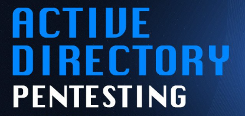

  

    

    <h1>Ciber-Notes Bestiaim</h1>

    

      Write-ups, apuntes e informes de laboratorios de ciberseguridad.
    

    

      
        Repositorio personal de documentación técnica, laboratorios de pentesting
        y notas de ciberseguridad.
      

       

      <a
        href="https://github.com/bestiaim/Ciber_notes"
        target="_blank"
        rel="noopener noreferrer"
      >
        Ver repositorio en GitHub
      </a>
    

  

  <h2 class="section-title">Máquinas resueltas e informes</h2>

  <!-- =====================================================
       NodeCeption
       ===================================================== -->

  

    

    

      <h2>
        <a href="maquinas/nodeception.html">
          NodeCeption - Pentesting Lab
        </a>
      </h2>

      

        Resolución paso a paso de la máquina vulnerable NodeCeption. El laboratorio
        incluye reconocimiento, escaneo de puertos, enumeración web, análisis de
        endpoints expuestos, explotación mediante el abuso de una automatización
        en n8n y escalada local de privilegios hasta obtener acceso root.
      

      

        Linux
        n8n
        Web
        REST API
        Reverse Shell
        Privilege Escalation
      

      

        Laboratorio académico · Write-up de pentesting
      

      

        <a
          class="btn-writeup"
          href="maquinas/nodeception.html"
        >
          Ver write-up
        </a>
      

    

  

  <!-- =====================================================
       Cyberpunk
       ===================================================== -->

  

    

    

      <h2>
        <a href="maquinas/cyberpunk.html">
          Cyberpunk - Pentesting Lab
        </a>
      </h2>

      

        Resolución técnica de la máquina Cyberpunk. El proceso documenta acceso
        FTP anónimo, exposición de archivos mediante Apache, carga de archivos en
        el webroot, ejecución de PHP, obtención de una shell inicial y escalada de
        privilegios mediante Python Library Hijacking.
      

      

        Linux
        FTP
        Apache
        PHP
        Webroot Upload
        Python Hijacking
      

      

        Laboratorio académico · Write-up de pentesting
      

      

        <a
          class="btn-writeup"
          href="maquinas/cyberpunk.html"
        >
          Ver write-up
        </a>
      

    

  

  <!-- =====================================================
       Pentest Active Directory
       ===================================================== -->

    

  <h2>
    <a
      href="maquinas/pentest-ad.html"
    >
      Pentest Active Directory - Laboratorio
    </a>
  </h2>

  

    Informe técnico anonimizado de una prueba de penetración ejecutada sobre
    un entorno Active Directory controlado. El laboratorio documenta
    exposición de respaldos web, extracción de información mediante
    esteganografía, enumeración anónima de LDAP y RPC, AS-REP Roasting,
    Kerberoasting, revisión de SYSVOL y Group Policy Preferences, análisis
    con BloodHound y validación de privilegios administrativos.
  

  

    Windows Server
    Active Directory
    LDAP
    Kerberos
    AS-REP Roasting
    Kerberoasting
    BloodHound
    GPP
  

  

    Laboratorio autorizado · Informe público anonimizado
  

  

    <a
      class="btn-writeup"
      href="maquinas/pentest-ad.html"
    >
      Ver informe
    </a>
  

  

    <strong>Aviso de uso:</strong>
    todo el contenido publicado corresponde a laboratorios controlados,
    máquinas vulnerables académicas o entornos autorizados. No se debe aplicar
    ninguna técnica descrita contra sistemas reales, redes de terceros o activos
    sin autorización explícita.
  

